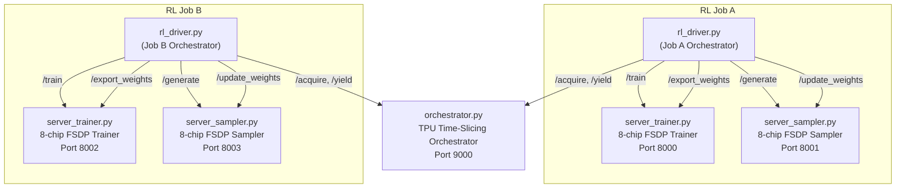
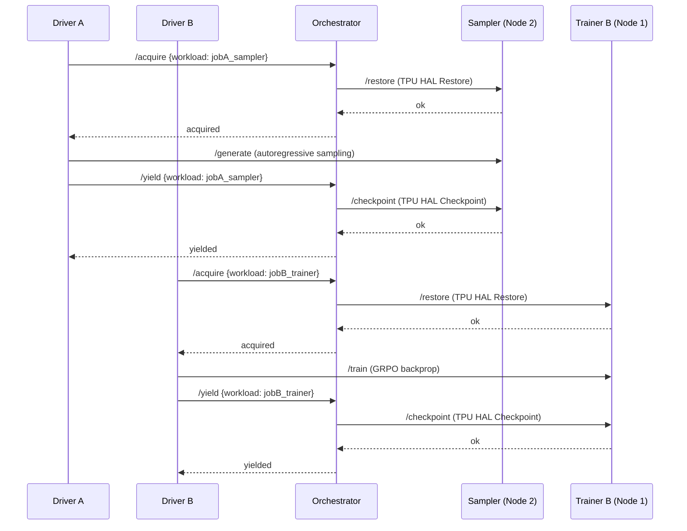

# Disaggregated TPU GRPO Reinforcement Learning (`rl-disagg`)

This directory contains a fully disaggregated, strictly synchronous, on-policy Group Relative Policy Optimization (GRPO) reinforcement learning pipeline for [TorchTitan](https://github.com/google-pytorch/torchtitan) on Google Cloud TPU.

---

## 1. Architecture Overview



### Components

| Component | File | Role |
|-----------|------|------|
| **Trainer Server** | [server_trainer.py](server_trainer.py) | 8-chip FSDP mesh that executes forward evaluation, GRPO policy gradient loss, and AdamW optimizer steps. Exposes HTTP endpoints for `/train`, `/export_weights`, `/checkpoint`, `/restore`. |
| **Sampler Server** | [server_sampler.py](server_sampler.py) | 8-chip FSDP mesh that executes distributed autoregressive generation. Exposes HTTP endpoints for `/generate`, `/update_weights`, `/checkpoint`, `/restore`. |
| **Orchestrator** | [orchestrator.py](orchestrator.py) | Centralized lock manager that coordinates TPU time-slicing. Manages `acquire`/`yield` flows and triggers hardware checkpoint/restore when workloads swap. |
| **RL Driver** | [rl_driver.py](rl_driver.py) | Per-job orchestrator client. Downloads GSM8K prompts, tokenizes them, sends to sampler, computes rule-based rewards, sends to trainer, and triggers weight sync. |
| **TPU HAL Snapshot** | [tpu_hal_snapshot.py](tpu_hal_snapshot.py) | Low-level checkpoint/restore agent. Calls `tpu.TpuHalService/Checkpoint` and `tpu.TpuHalService/Restore` via `grpcurl` on each `libtpu` Unix domain socket. |
| **Reward Engine** | [reward.py](reward.py) | Rule-based GSM8K reward computation and GRPO advantage normalization. Pure Python, runs on the driver. |

---

## 2. How Training Works

The trainer runs on an independent 8-chip TPU FSDP mesh ([server_trainer.py](server_trainer.py)).

### SPMD Control Loop

The trainer uses a **CPU-idle SPMD control loop** instead of `torch.distributed.broadcast_object_list`:

1. **Rank 0** runs a FastAPI HTTP server in a background thread and blocks on a `queue.Queue` for incoming commands.
2. **Ranks 1–7** block on localhost TCP `socket.recv()` via `CPUCommandBroadcast`.
3. When Rank 0 receives an HTTP request, it pushes the command to the queue, then broadcasts it to all ranks over the TCP socket. All ranks execute the SPMD operation in lockstep.

> [!IMPORTANT]
> This `CPUCommandBroadcast` pattern is critical for hardware oversubscription: while waiting for HTTP commands, Ranks 1–7 block in OS kernel space on `socket.recv()`, executing **zero TPU hardware instructions**. This drives idle TPU duty cycle to **0.00%**, enabling clean handoff to the other time-sliced job.

### Training Step (`/train`)

Each `/train` request carries `prompt_ids`, `completed_ids`, and `advantages`:

1. The model runs a **no-grad forward pass** on `completed_ids` to compute `token_log_probs` (the "old" policy log-probs).
2. A frozen **reference model** (`ref_model`) also runs a forward pass to compute `ref_token_log_probs`.
3. GRPO loss is computed using PPO-clipped importance sampling with the ratio $\frac{\pi_\theta(a|s)}{\pi_{\theta_{\text{old}}}(a|s)}$ and a KL penalty against the reference policy (see [grpo_utils.py](../grpo_utils.py)).
4. `loss.backward()` + `optimizer.step()` updates the model weights.
5. Multiple PPO/GRPO inner epochs are run per step (configurable via `TRAIN_EPOCHS`).

### Weight Export (`/export_weights`)

After training, the trainer gathers all FSDP shards via `full_tensor()` and saves the full state dict to `/tmp/trainer_weights.pt`. The sampler downloads this file over HTTP and reloads it into its own FSDP mesh, guaranteeing **100% on-policy weight synchronization**.

---

## 3. How Sampling Works

The sampler runs on a separate 8-chip TPU FSDP mesh ([server_sampler.py](server_sampler.py)).

### Autoregressive Generation (`/generate`)

1. The sampler receives `prompt_ids` (a batch of tokenized prompts, left-padded to a static `prompt_len` to prevent XLA recompilation).
2. It calls `grpo_sampler.generate()` (see [grpo_sampler.py](../grpo_sampler.py)) which performs distributed autoregressive token-by-token generation.
3. Generation uses `fsdp.FullyShardedDataParallel.summon_full_params()` to materialize full parameters before sampling, then operates directly on clean model logits with temperature scaling.
4. The completed token IDs (prompt + generated tokens) are returned to the driver.

### Weight Reload (`/update_weights`)

The sampler downloads `/tmp/trainer_weights.pt` from the trainer via HTTP, converts plain CPU tensors to DTensors matching the sampler's FSDP mesh using `distribute_tensor()`, and calls `load_state_dict()`. This hot-reload takes ~50–100 milliseconds.

### Micro-Batching

Both generation and training requests are chunked into **micro-batches of size 4** (~2.5 GB HBM per call) to guarantee 100% OOM immunity across arbitrary rollout volumes. This is controlled by `MICRO_BATCH_SIZE`, `ROLLOUT_BATCH_SIZE`, and `TRAIN_BATCH_SIZE` environment variables.

---

## 4. Checkpoint & Restore (TPU HAL Snapshot)

The checkpoint/restore mechanism is the core enabler for hardware oversubscription. It operates at the **TPU hardware level**, below PyTorch/XLA.

### How It Works

Each `libtpu.so` instance exposes a Unix domain socket at `/run/tpu_hal_<pid>.sock`. The [tpu_hal_snapshot.py](tpu_hal_snapshot.py) module:

1. **Discovers sockets** by scanning `/run/tpu_hal_*.sock` and filtering by cgroup to find only sockets belonging to the current pod/container.
2. **Issues gRPC calls** via `grpcurl` subprocesses (to avoid symbol clashes between Python's `grpcio` and `libtpu.so`'s static gRPC):
   - `tpu.TpuHalService/Checkpoint` — snapshots the live TPU VFIO device state to host memory.
   - `tpu.TpuHalService/Restore` — restores the saved VFIO device state back to the TPU hardware.
3. **Fans out concurrently** across all 8 sockets using a `ThreadPoolExecutor` (or sequentially if `CR_SEQUENTIAL=1`).

### Custom `_libtpu.so`

Time-slicing requires a custom-built `_libtpu.so` that supports the UDS-based `Checkpoint`/`Restore` gRPC methods. See the [deploy README](deploy/README.md) for download instructions.

### Known Issue: Concurrent Restore Crash on v6e

> [!WARNING]
> On TPU v6e, concurrent `Restore` calls across all 8 sockets can trigger a **hard C++ segmentation fault** inside `libtpu.so`'s internal gRPC server. The crash occurs in `grpc::internal::CallbackUnaryHandler<...>::Deserialize()` due to a null-pointer dereference when the `tpunetd` daemon floods `NotifyRequest` callbacks during concurrent restores. A core dump was captured and analyzed — see the root cause analysis for full backtrace and disassembly.

---

## 5. Hardware Oversubscription (Time-Slicing)

The key innovation: **two independent RL jobs share the same physical TPU nodes**, but never use them simultaneously. When one job is sampling, the other is training on a different node — and vice versa.

### Time-Slicing Flow



### Pool-Based Locking

The orchestrator ([orchestrator.py](orchestrator.py)) manages two independent lock pools:

| Pool | TPU Node | Workloads |
|------|----------|-----------|
| `sampler` | Node 2 | `jobA_sampler`, `jobB_sampler` |
| `trainer` | Node 1 | `jobA_trainer`, `jobB_trainer` |

- **`/acquire`**: A driver requests exclusive access to a pool. The orchestrator blocks on a `threading.Lock` until the pool is free. If the pool's previous holder checkpointed, the orchestrator calls `/restore` on the new workload's HTTP endpoint to restore TPU state.
- **`/yield`**: The driver releases the pool. The orchestrator calls `/checkpoint` on the workload's HTTP endpoint to snapshot TPU state, then releases the lock.


---

## 6. Orchestrating Two RL Jobs

The system runs **two completely independent GRPO training loops** (Job A and Job B) simultaneously, each with its own trainer, sampler, and driver. They share the same two TPU nodes via time-slicing.

### Kubernetes Deployment

The deployment manifest ([deploy/rl-disagg.yaml](deploy/rl-disagg.yaml)) creates:

| Pod | Node | Role |
|-----|------|------|
| `trainer-a` | Node 1 (trainer pool) | Job A trainer (port 8000) |
| `sampler-a` | Node 2 (sampler pool) | Job A sampler (port 8001) |
| `trainer-b` | Node 1 (via podAffinity to trainer-a) | Job B trainer (port 8002) |
| `sampler-b` | Node 2 (via podAffinity to sampler-a) | Job B sampler (port 8003) |
| `driver-a-job` | Any | Job A orchestrator client |
| `driver-b-job` | Any | Job B orchestrator client |
| `orchestrator-deployment` | Any | Centralized lock manager (port 9000) |

### Pod Affinity Co-location

Job B's trainer uses a `podAffinity` to co-locate on the same node as Job A's trainer:

```yaml
affinity:
  podAffinity:
    requiredDuringSchedulingIgnoredDuringExecution:
    - labelSelector:
        matchExpressions:
        - key: app
          operator: In
          values:
          - trainer-a
      topologyKey: kubernetes.io/hostname
```

This ensures both trainers share the same physical TPU node (and thus the same VFIO devices), enabling the checkpoint/restore handoff. The same applies to the samplers.

### Job B's Direct VFIO Access

Job B's trainer and sampler pods are configured with:
- `securityContext.privileged: true`
- Direct `/dev/vfio` hostPath mount
- `TPU_ACCELERATOR_TYPE`, `TPU_TOPOLOGY`, and related environment variables
- These allow the second job to directly access the TPU VFIO devices without the GKE TPU resource scheduler

### Driver Orchestration

Each driver ([rl_driver.py](rl_driver.py)) runs its own RL loop independently:

1. **Register** both its sampler and trainer workloads with the orchestrator.
2. **Acquire** the sampler pool → orchestrator restores TPU state → driver calls `/start` → driver calls `/generate` in micro-batches.
3. **Yield** the sampler pool → orchestrator checkpoints TPU state.
4. **Acquire** the trainer pool → orchestrator restores TPU state → driver calls `/start` → driver calls `/train` across multiple GRPO epochs.
5. **Export** updated weights from trainer → **yield** trainer pool → **acquire** sampler pool → **update** sampler weights → hold sampler lock for next iteration.

The `holding_sampler` optimization skips the checkpoint/restore cycle when the same job holds the sampler pool across consecutive steps (e.g., after weight sync, the sampler stays acquired for the next generation phase).

---
