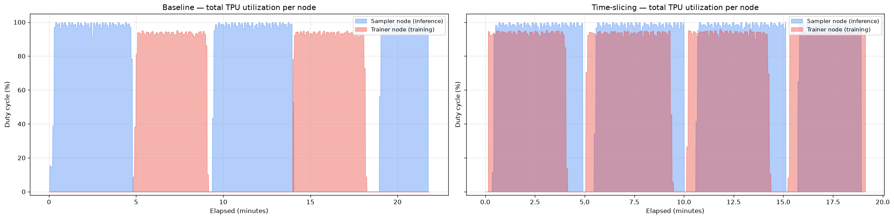
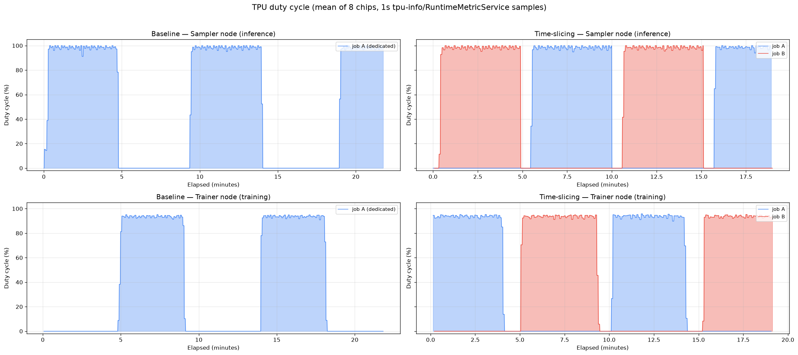
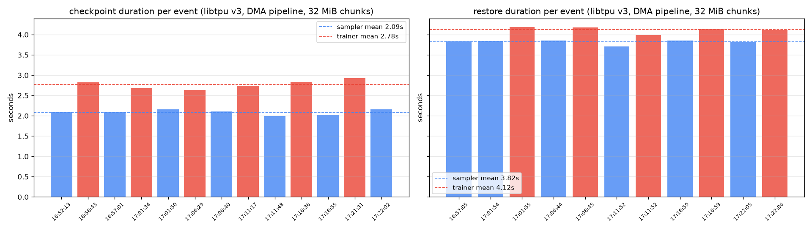
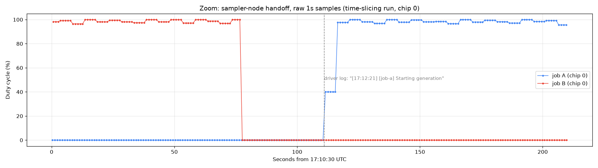

# TPU Duty Cycle: Baseline vs Time-Slicing (libtpu v3, 2026-07-30)

Real measurements from the rl-disagg GRPO PoC (Qwen3-0.6B, GSM8K) on
`tpu-cluster` / us-central1, two v5e 2x4 nodes, image `torchtitan-rl:libtpuv3`,
libtpu staged from `gs://linglinll-gke-dev-libtpu/_libtpuv3.so` with
`LIBTPU_CHECKPOINTING_ENABLED=on`, `LIBTPU_CHECKPOINTING_USE_DMA_PIPELINE=true`,
`LIBTPU_CHECKPOINTING_CHUNK_SIZE=33554432`.

- **Baseline**: one GRPO job, dedicated sampler node + dedicated trainer node
  (`deploy/rl-disagg-baseline.yaml`), 21.8 min.
- **Time-slicing**: two GRPO jobs sharing the same two nodes via libtpu
  pipe-based checkpoint/restore (`deploy/rl-disagg.yaml`), 19.0 min.

Duty cycle is `tpu.runtime.tensorcore.dutycycle.percent` sampled every second
from libtpu's `RuntimeMetricService` — the same gRPC service and metric the
`tpu-info` CLI reads — via `telemetry/tpu_duty_cycle.py` running inside each
TPU pod. A checkpointed (detached) process reports 0%. Raw CSVs are in
`baseline/` and `timeslice/`; no synthetic or interpolated data.

## Summary

| Metric | Baseline (1 job) | Time-slicing (2 jobs) |
|---|---|---|
| Sampler node: % time active | 56.2% | **88.6%** |
| Trainer node: % time active | 39.4% | **87.3%** |
| Sampler node: duty cycle while active | 95.8% | 97.2% |
| Trainer node: duty cycle while active | 90.1% | 91.2% |
| Per-job step time | ~9.6 min | ~10.2 min |
| Aggregate step throughput | 1 step / 9.6 min | 1 step / ~5.1 min (**~1.9x**) |

Time-slicing keeps both nodes ~88% busy vs 39–56% for the baseline, at the
cost of ~6% longer per-job steps (checkpoint/restore + lock handoffs).

## Total node utilization



Baseline is an anti-phase square wave: the sampler node idles while the job
trains and vice versa. With time-slicing, jobs A and B interleave and both
nodes stay busy nearly continuously.

## Per-node duty cycle by job



On each shared node the two jobs alternate back-to-back (blue = job A,
red = job B); each individual job still steps at the same ~10 min cadence as
the baseline because generation (~4.7 min) fits inside the other job's
training window (~4.9 min).

## Checkpoint / restore latency

From the orchestrator log (`timeslice/orchestrator.log`), all C/R events in
the 35-minute window (8 ranks per pool, DMA pipeline, 32 MiB chunks):

| Operation | Pool | Events | Mean | Min | Max |
|---|---|---|---|---|---|
| checkpoint | sampler | 7 | 2089 ms | 1994 ms | 2159 ms |
| checkpoint | trainer | 6 | 2776 ms | 2640 ms | 2929 ms |
| restore | sampler | 6 | 3819 ms | 3712 ms | 3858 ms |
| restore | trainer | 5 | 4123 ms | 3988 ms | 4190 ms |
| **checkpoint** | **all** | **13** | **2406 ms** | 1994 ms | 2929 ms |
| **restore** | **all** | **11** | **3957 ms** | 3712 ms | 4190 ms |



Trainer C/R is consistently ~0.3–0.7 s slower than sampler C/R (larger live
state: optimizer + gradients vs weights + KV cache). Total handoff cost per
swap is ~6 s of C/R plus lock coordination.

## Handoff fine structure



Raw 1 s samples around a sampler-node handoff: job B checkpoints and drops to
0%, ~35 s later job A is restored and ramps up (the 40% samples are the metric
window catching the burst start). The dashed line marks the driver-log event
`[17:12:21] [job-a] Starting generation` — log and metric agree to the second.

## Files

- `dashboard.html` — self-contained dashboard (all plots + summary)
- `{baseline,timeslice}/tpu_duty_cycle_*.csv` — raw 1 s per-chip samples
- `timeslice/orchestrator.log` — lock/C/R event log (source of the table above)
- `{baseline,timeslice}/driver-*.log` — per-step RL driver logs

## Reproducing

```bash
# scrape (inside each TPU pod; PORTS per pod's TPU_RUNTIME_METRICS_PORTS)
PORTS=8431,...,8438 PHASE=timeslice CSV_FILE=/tmp/tpu_duty_cycle_<role>.csv \
  python3 telemetry/tpu_duty_cycle.py

# plot
python3 telemetry/compare_dashboard.py \
  --baseline-dir runs/libtpuv3_20260730/baseline \
  --timeslice-dir runs/libtpuv3_20260730/timeslice \
  --output runs/libtpuv3_20260730/dashboard.html
```
